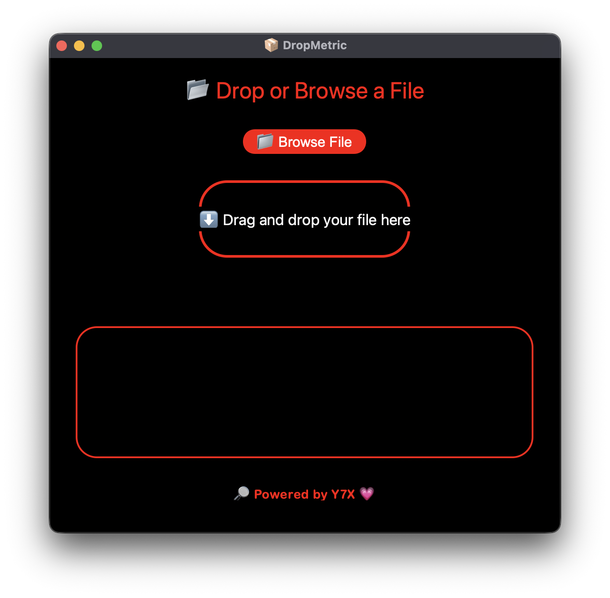

<div align="center">

# 📦 DropMetric
**🧊 UI so smooth it slipped through the matrix**

Measure the true size of any file — in red-hot AMOLED style.
A glowing file size analyzer that’s as sleek as it is snappy.
Branded with 💗 by [Y7X-bit](https://github.com/Y7X-bit)



</div>

---

## 🌟 Features at a Glance

- 📂 Drag & drop or browse to select files
- 📏 Shows size in **Bytes, KB, and MB**
- 🌑 Full **AMOLED** layout with **pitch red** outlines
- 🧼 Smooth, curvy UI with glowing detail
- ✅ Built with `customtkinter` + `tkinterdnd2`
- 💗 Signature footer: **"🔎 Powered by Y7X 💗"**

---

## 🖥️ Installation

> Python 3.9 or later required

```bash
git clone https://github.com/Y7X-bit/DropMetric.git
cd DropMetric
pip install -r requirements.txt
python DropMetric.py